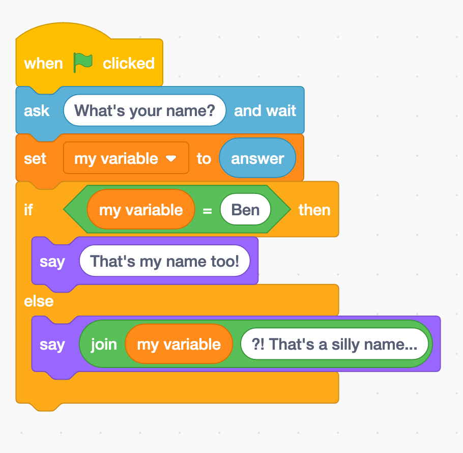

# JS 101 - Conditional Statements

Conditional statements allow us to write programs that perform the different actions depending on the situation. The main way we write these is with `if`, `else` and `else if` statements.

## The basic if...

```js
if (condition) {
  // code to run if condition is true
}
```

Inside the smooth brackets, the if statement expects a expression that resolves to `true` or `false`. This is called a boolean expression.

Example boolean expressions...

- `1 > 3` (false)
- `1 === 1` (true)
- `8 < 10` (true)

```js
if (1 > 3) {
  console.log("Well, duh! Of course 1 isn't greater than three...");
}
```

Well yes, one is always going to be greater than three. We will usually be checking something that can change like a variable.

```js
let numberOfPies = getPieCount();

if (numberOfPies < 1) {
  console.log("Who ate all the pies???");
}
```

## If/else

The else statement will run if the the previous ifs or if elses have not run. There can **only** be one and it **must** be the last in the chain.

```js
let numberOfPies = getPieCount();

if (numberOfPies < 1) {
  console.log("Who ate all the pies???");
} else {
  console.log("We got pies! Who's hungry?");
}
```

## Else If

You can put as many else ifs in as you like, they **cannot** be first as the chain must always start with an if. You **must** supply a condition.

```js
let numberOfPies = getPieCount();

if (numberOfPies < 1) {
  console.log("Who ate all the pies???");
} else if (numberOfPies < 5) {
  console.log("Not many pies left, get them whilst you can!");
} else {
  console.log("We got pies! Who's hungry?");
}
```

## Exercise

Translate the following code blocks to javascript.



